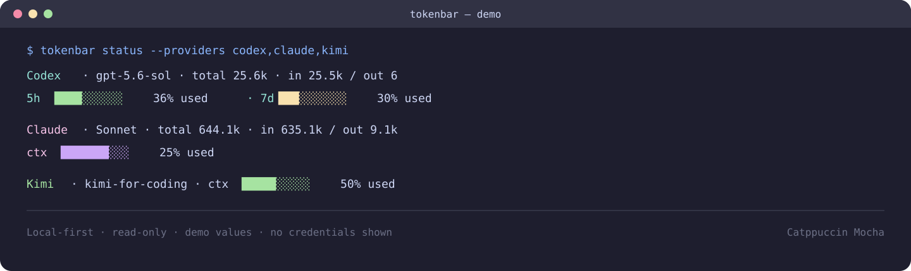

# tokenbar

A local-first usage status bar for AI CLI tools. It provides a unified view of tokens, context usage, and rate limits for Codex, Claude Code, and Kimi Code.

[中文 README](README.md)

The canonical command is `tokenbar`; the previous `ai-cli-statusline` command remains available as a compatibility alias.



> This is a demo rendering with synthetic values; it does not represent real account limits.

## Features

- Unified ANSI status-line and JSON output.
- One-shot `status` and continuously refreshing `watch` commands.
- Codex: reads account limits through `codex app-server --stdio` and reads local session tokens and model metadata in read-only mode.
- Claude Code: scans local session logs and supports Claude's official `statusLine` stdin protocol.
- Kimi Code: scans `wire.jsonl` and configurable local session directories, and supports Kimi's official `[status_line].command` stdin protocol.
- Other tools: built-in JSONL readers for Gemini, Pi, OMP, OmO, and Goose, read-only SQLite readers for Cursor, OpenCode, Copilot, Kilo, Zed, and Qoder, plus configurable custom log roots.
- Progress bars use `█` and `░`; percentages are explicitly labeled as usage.

## Installation

Python 3.10 or newer is required. The project uses only the Python standard library.

```bash
cd tokenbar
python3 -m venv .venv
source .venv/bin/activate
python3 -m pip install -e .
```

### Start in three commands

```bash
tokenbar status
tokenbar watch --interval 5
tokenbar status --json --no-color
```

To inspect only one tool:

```bash
tokenbar status --providers claude
tokenbar status --providers kimi
```

Run directly from source if you do not want to install the package:

```bash
PYTHONPATH=src /usr/local/bin/python3.11 -m ai_cli_statusline status --no-color
```

## Usage

Show a single snapshot:

```bash
tokenbar status --providers codex,claude,kimi
```

Refresh continuously:

```bash
tokenbar watch --providers codex,claude,kimi --interval 10
```

Select a color theme:

```bash
tokenbar status --theme catppuccin-mocha
tokenbar watch --theme nord
tokenbar status --theme dracula
```

Available themes are `catppuccin-mocha`, `nord`, `dracula`, and `default`. Set `AI_CLI_STATUSLINE_THEME` to choose a default; Claude and Kimi native status-line commands read the same environment variable.

Progress bars can also use text/pixel glyphs without emoji:

```bash
tokenbar watch --progress-style ascii
tokenbar watch --progress-style thin
tokenbar watch --progress-style dots
```

Available styles are `blocks`, `ascii`, `thin`, and `dots`. You can also set `AI_CLI_STATUSLINE_PROGRESS_STYLE`; Claude and Kimi native status-line commands read the same environment variable.

Emit machine-readable JSON:

```bash
tokenbar status --json --no-color
```

`--providers` accepts a comma-separated provider list. An unavailable provider is reported as unavailable; the tool never fabricates usage data.

## Native CLI integrations

Print the integration instructions for a provider:

```bash
tokenbar integrate claude
tokenbar integrate kimi
tokenbar integrate codex

# Write the configuration automatically; existing settings are not overwritten by default
tokenbar setup claude
tokenbar setup kimi
```

### Claude Code

Claude Code runs a configured `statusLine` command, passes session JSON to its stdin, and renders the command's stdout in the footer. Merge the output of `integrate claude` into `~/.claude/settings.json`:

```json
{
  "statusLine": {
    "type": "command",
    "command": "tokenbar claude-statusline",
    "refreshInterval": 5
  }
}
```

Test the adapter with mock input:

```bash
printf '%s\n' '{"model":{"display_name":"Sonnet"},"context_window":{"used_percentage":25,"context_window_size":200000}}' \
  | tokenbar claude-statusline
```

### Kimi Code

Recent Kimi Code releases use `~/.kimi-code/tui.toml`; older releases may use `~/.kimi/tui.toml`. Add:

```toml
[status_line]
command = "tokenbar kimi-statusline"
```

Run `/reload-tui` in Kimi after editing the file. Kimi limits custom status-line command execution time, so keep the command lightweight.

`setup` creates a `.bak` backup before modifying a file. If a `statusLine` or `[status_line]` already exists, setup stops unless `--force` is provided.

### Codex

The native Codex footer currently uses built-in `tui.status_line` items and does not expose an external command callback. This project therefore uses two layers:

1. Keep Codex's native token, context, and limit fields enabled.
2. Use a Stop Hook for a colored usage summary; run `watch` when continuous external refresh is needed.

The project does not present external output as Codex's native TUI footer.

### Other CLIs and custom logs

Use `auto` to inspect all built-in platforms in one command:

```bash
tokenbar status --providers auto
```

Built-in providers and data sources:

| Provider | Local source | Reader |
| --- | --- | --- |
| `codex` | app-server and `state_5.sqlite` | read-only RPC + SQLite |
| `claude` | `~/.claude/projects/**/*.jsonl` | JSONL + status-line cache |
| `kimi` | `~/.kimi-code/**/wire.jsonl` | wire JSONL + status-line cache |
| `gemini`, `antigravity`, `deepseek`, `pi`, `omp`, `omo`, `goose`, `craft`, `reasonix`, `roo`, `lmstudio` | native session/log JSONL directories | generic JSONL |
| `cursor`, `opencode`, `copilot`, `kilo`, `zed`, `qoder`, `anythingllm`, `devin`, `mimo`, `zcode` | common local SQLite directories | read-only SQLite token columns |

For example:

```bash
tokenbar status --providers claude,kimi,gemini,pi
```

For another CLI, provide read-only log roots through `AI_CLI_STATUSLINE_SOURCES`:

```bash
export AI_CLI_STATUSLINE_SOURCES='{"my-cli":["~/.my-cli/sessions"]}'
tokenbar status --providers my-cli
```

The generic JSONL reader recognizes `usage`, `input_tokens` / `output_tokens`, and `prompt_tokens` / `completion_tokens`. The SQLite reader only reads numeric columns whose names contain token, input, output, prompt, completion, or cache.

## Data and privacy

- Reads only local CLI state databases, session logs, or read-only app-server interfaces.
- Does not read, print, or commit API keys, OAuth credentials, or authentication files.
- Does not output full prompts, responses, or transcript bodies.
- Codex SQLite access uses a read-only connection and `PRAGMA query_only=ON`.
- Missing CLIs and unrecognized logs are reported as unavailable.

## Verification

```bash
PYTHONPATH=src /usr/local/bin/python3.11 -m pytest -q
```

Offline tests cover progress-bar boundaries, unified rendering, nested usage aggregation, configurable log roots, and stdin status-line protocols. Claude Code is installed on the current machine; Kimi Code is not installed, so Kimi TUI integration has not been verified against a live session.

## When a provider is unavailable

1. Run `tokenbar status --json --no-color` and inspect each provider's `source` and `error`.
2. For Claude Code, check that `~/.claude/projects/` contains a recent JSONL session.
3. For Kimi Code, check for `wire.jsonl` under `~/.kimi-code/sessions/`; older releases use `~/.kimi/`.
4. For custom locations, set `CLAUDE_CONFIG_DIR`, `KIMI_CODE_HOME`, or `AI_CLI_STATUSLINE_SOURCES`.
5. Rate limits are shown only when supplied by a status-line snapshot or an official read-only endpoint; they are never inferred from token totals.

## Project status

See [ROADMAP.md](ROADMAP.md) for current progress and open verification items. Open-source publication, remote pushes, and production deployment are not performed by default.

## License

[MIT License](LICENSE)
