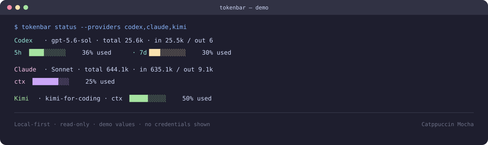

# tokenbar

A local-first usage status bar for AI CLI tools. It displays available tokens, context occupancy, and account limits in the terminal. Progress requires an explicit percentage or occupancy/capacity from the source; token totals cannot establish it.

[中文 README](README.md)

The canonical command is `tokenbar`; the previous `ai-cli-statusline` command remains available as a compatibility alias.



> This is a demo rendering with synthetic values; it does not represent real account limits.

## Current capabilities

There are 24 registered providers: 4 stable, 12 experimental, and 8 planned. Stable describes reader/protocol maturity; it does not guarantee an installed CLI or a valid local session. One unavailable provider does not block the others.

| Tool | Token source | Context progress | Account limit progress |
| --- | --- | --- | --- |
| Codex | Read-only local SQLite | Not provided by the current reader | Read-only app-server RPC; failure preserves local tokens and reports an error |
| Claude Code | Local sessions and official stdin callback | Official stdin callback | Shown when stdin provides quota windows |
| Kimi Code | Local `wire.jsonl` | Official stdin `contextTokens` / `maxContextTokens` | No dedicated quota source yet |
| OpenCode | Read-only local SQLite | Not provided by the current reader | Not provided by the current reader |

See the [provider support audit](docs/provider-support-audit.md) for sources and limitations, and [ROADMAP.md](ROADMAP.md) and the [terminal verification report](docs/terminal-verification.md) for live results and verification history.

## Features

- Unified ANSI status-line and JSON output.
- One-shot `status` and continuously refreshing `watch` commands.
- Codex: reads account limits through `codex app-server --stdio` and reads local session tokens and model metadata in read-only mode.
- Claude Code: scans local session logs and supports Claude's official `statusLine` stdin protocol.
- Kimi Code: scans `wire.jsonl` and configurable local session directories, and supports Kimi's official `[status_line].command` stdin protocol.
- OpenCode: reads explicitly allowlisted `session.tokens_*` aggregates; legacy databases extract only token/model paths inside SQLite, without returning message bodies to Python.
- Other tools are classified as stable, experimental, or planned; `auto` includes only stable providers with dedicated readers and regression evidence.
- Progress bars use `█` and `░`; percentages are explicitly labeled as usage.

## Installation

Python 3.10 or newer is required. On Python 3.10, `tomli` is installed as a compatibility dependency for the standard-library `tomllib` module.

Check `python3 --version` first. If it is older than 3.10 and Python 3.11 is already installed, create the virtual environment with `python3.11 -m venv .venv`, then follow the activation and installation steps below.

```bash
cd tokenbar
python3 -m venv .venv
source .venv/bin/activate
python3 -m pip install -e .
```

### Start in three commands

```bash
tokenbar status --providers auto
tokenbar watch --providers auto --interval 5
tokenbar status --providers auto --json --no-color
```

To inspect only one tool:

```bash
tokenbar status --providers claude
tokenbar status --providers kimi
```

Run directly from source if you do not want to install the package:

```bash
PYTHONPATH=src python3 -m ai_cli_statusline status --providers auto --no-color
```

## Usage

Show a single snapshot:

```bash
tokenbar status --providers codex,claude,kimi
```

Refresh continuously:

```bash
tokenbar watch --providers codex,claude,kimi --interval 10
```

Select a color theme:

```bash
tokenbar status --theme catppuccin-mocha
tokenbar watch --theme nord
tokenbar status --theme dracula
```

Available themes are `catppuccin-mocha`, `nord`, `dracula`, and `default`. Set `AI_CLI_STATUSLINE_THEME` to choose a default; Claude and Kimi native status-line commands read the same environment variable.

Progress bars can also use text/pixel glyphs without emoji:

```bash
tokenbar watch --progress-style ascii
tokenbar watch --progress-style thin
tokenbar watch --progress-style dots
```

Available styles are `blocks`, `ascii`, `thin`, and `dots`. You can also set `AI_CLI_STATUSLINE_PROGRESS_STYLE`; Claude and Kimi native status-line commands read the same environment variable.

`watch` puts each provider on separate rows and wraps to the terminal width. In a capable TTY it uses an alternate screen and restores the original screen and cursor on Ctrl-C or SIGTERM, including with `--no-color` or `NO_COLOR`. Redirected output, `--json`, and `TERM=dumb` use append-only output without screen control sequences. `status` and native stdin callbacks keep single-line output.

Ctrl-C exits with status 0; SIGTERM (ordinary `kill`) exits with status 143. Both run terminal cleanup and restore the previous SIGTERM handler. The complete provider list is validated before entering the alternate screen, so invalid-name diagnostics remain on the original screen and exit with status 2.

`ctx` is context occupancy; `5h` / `7d` are account quota usage. Token totals cannot establish either percentage. Reset countdowns use upstream timestamps; `reset due` keeps the reported percentage until a fresh snapshot arrives.

Emit machine-readable JSON:

```bash
tokenbar status --json --no-color
```

`--providers` accepts a comma-separated provider list. An unavailable provider is reported as unavailable; the tool never fabricates usage data.

For a stream of JSON snapshots, run `tokenbar watch --providers auto --json --interval 5`. Each refresh emits one JSON array on one line.

| Exit code | Meaning |
| --- | --- |
| `0` | `status` has at least one current data item, or `watch` exits normally via Ctrl-C |
| `1` | `status` has no current data |
| `2` | Invalid arguments or provider name |
| `143` | `watch` received SIGTERM and completed exit cleanup |

## Native CLI integrations

Print the integration instructions for a provider:

```bash
tokenbar integrate claude
tokenbar integrate kimi
tokenbar integrate codex

# Write the configuration automatically; existing settings are not overwritten by default
tokenbar setup claude
tokenbar setup kimi
```

### Claude Code

Claude Code runs a configured `statusLine` command, passes session JSON to its stdin, and renders the command's stdout in the footer. Merge the output of `integrate claude` into `~/.claude/settings.json`:

```json
{
  "statusLine": {
    "type": "command",
    "command": "tokenbar claude-statusline",
    "refreshInterval": 5
  }
}
```

Test the adapter with mock input:

```bash
printf '%s\n' '{"model":{"display_name":"Sonnet"},"context_window":{"used_percentage":25,"context_window_size":200000}}' \
  | tokenbar claude-statusline
```

### Kimi Code

Recent Kimi Code releases use `~/.kimi-code/tui.toml`; older releases may use `~/.kimi/tui.toml`. Add:

```toml
[status_line]
command = "tokenbar kimi-statusline"
```

Run `/reload-tui` in Kimi after editing the file. Kimi limits custom status-line command execution time, so keep the command lightweight.

Kimi's official stdin payload uses `contextTokens` and `maxContextTokens` for context occupancy, not cumulative token usage or account quota. Claude's fallback context calculation includes input, cache creation, and cache read tokens. Both callbacks accept `--no-color`, `--theme`, and `--progress-style`.

Check the callback using synthetic input:

```bash
printf '%s\n' '{"model":"kimi-k2","contextTokens":102400,"maxContextTokens":204800}' \
  | tokenbar kimi-statusline --no-color --progress-style ascii
```

Expected output: `Kimi · kimi-k2 · ctx #####..... 50% used`. This demonstrates the payload and rendering only, not a real session or account quota.

`setup` creates a `.bak` backup before modifying a file. If a `statusLine` or `[status_line]` already exists, setup stops unless `--force` is provided.

### Codex

The native Codex footer uses built-in `tui.status_line` items. This project has no configuration entry point for injecting an external command into that footer. To use it alongside Codex:

1. Keep Codex's native token, context, and limit fields enabled.
2. Run `tokenbar watch --providers codex --interval 5` in a separate terminal to display local tokens and any available account limits.

The project does not present external output as Codex's native TUI footer.

### Other CLIs and custom logs

Use `auto` to inspect all stable providers in one command:

```bash
tokenbar status --providers auto
```

Built-in providers and data sources:

| Maturity | Provider | Local source and reader |
| --- | --- | --- |
| stable (`auto`) | `codex` | read-only app-server limit RPC + explicit fields in `state_*.sqlite` |
| stable (`auto`) | `claude` | `~/.claude/projects/**/*.jsonl` + status-line cache |
| stable (`auto`) | `kimi` | `~/.kimi-code/**/wire.jsonl` + status-line cache |
| stable (`auto`) | `opencode` | current `session.tokens_*`; legacy databases use SQLite `json_extract` only on usage paths in `message.data` |
| experimental (explicit only) | `cursor` | privacy-restricted; local auth tokens are not read, so usage is currently unavailable |
| experimental (explicit only) | `gemini`, `pi`, `omp` | reads Gemini `messages[].tokens` and Pi/OMP assistant-message `usage` from documented saved sessions |
| experimental (explicit only) | `goose`, `roo`, `copilot`, `kilo`, `zed`, `anythingllm`, `devin`, `zcode` | provider-specific readers; Copilot uses OTel, Zed supports legacy uncompressed threads, and the rest use explicit SQLite/JSON fields |
| planned / restricted | `antigravity`, `deepseek`, `omo`, `craft`, `reasonix`, `lmstudio`, `qoder`, `mimo` | this project has not implemented and verified dedicated readers; explicit selection explains the limitation instead of guessing |

For example:

```bash
tokenbar status --providers claude,kimi,gemini,pi
```

GitHub Copilot CLI requires its official OTel file exporter. Content capture stays disabled, and tokenbar counts only `chat` spans:

```bash
mkdir -p "$HOME/.copilot/otel"
export COPILOT_OTEL_FILE_EXPORTER_PATH="$HOME/.copilot/otel/copilot.jsonl"
export OTEL_INSTRUMENTATION_GENAI_CAPTURE_MESSAGE_CONTENT=false
copilot
tokenbar status --providers copilot
```

For another CLI, provide read-only log roots through `AI_CLI_STATUSLINE_SOURCES`:

The dedicated Gemini, Pi, and OMP readers also accept this setting and prefer configured roots; logs must still match each provider's supported format.

```bash
export AI_CLI_STATUSLINE_SOURCES='{"my-cli":["~/.my-cli/sessions"]}'
tokenbar status --providers my-cli
```

The generic JSONL reader recognizes `usage`, `input_tokens` / `output_tokens`, and `prompt_tokens` / `completion_tokens`, but it is experimental; to keep `watch` responsive, it reads only the last 8 MiB of each file by default. SQLite readers no longer guess from column names; they may query only tables and columns explicitly allowlisted by a provider-specific schema. See the [provider support audit](docs/provider-support-audit.md) for the complete matrix.

## Data and privacy

- Reads only local CLI state databases, session logs, or read-only app-server interfaces.
- Does not read, print, or commit API keys, OAuth credentials, or authentication files.
- Does not output full prompts, responses, or transcript bodies.
- SQLite readers use read-only connections, `PRAGMA query_only=ON`, and positive column allowlists; they never query `access_token`, `refresh_token`, or `token_expiry`.
- Status-line caches merge partial fields and become explicitly stale after 24 hours by default; customize this with `AI_CLI_STATUSLINE_CACHE_TTL_SECONDS`.
- Missing CLIs and unrecognized logs are reported as unavailable.

## Verification

```bash
PYTHONPATH=src /usr/local/bin/python3.11 -m pytest -q
```

Tests cover credential-column isolation, partial Codex failures, database fallback, bounded JSONL reads, cache handling, provider schemas, stdin protocols, and POSIX PTY progress updates, monochrome repainting, and screen restoration. See the [terminal and provider verification report](docs/terminal-verification.md) for the current 24-provider results and remaining live-verification boundaries. Cross-platform terminal rendering and actual host-TUI callbacks remain environment-specific checks.

## When a provider is unavailable

1. Run `tokenbar status --json --no-color` and inspect each provider's `source` and `error`.
2. For Claude Code, check that `~/.claude/projects/` contains a recent JSONL session.
3. For Kimi Code, check for `wire.jsonl` under `~/.kimi-code/sessions/`; older releases use `~/.kimi/`.
4. For custom locations, set `CLAUDE_CONFIG_DIR`, `KIMI_CODE_HOME`, or `AI_CLI_STATUSLINE_SOURCES`.
5. Rate limits are shown only when supplied by a status-line snapshot or an official read-only endpoint; they are never inferred from token totals.

### Common installation and Kimi issues

- **`externally-managed-environment`**: This is Homebrew Python's PEP 668 protection. Create and use a project virtual environment; do not add `--break-system-packages`:

  ```bash
  python3 -m venv .venv
  .venv/bin/python -m pip install -e .
  .venv/bin/tokenbar status --providers kimi
  ```

- **`tokenbar: command not found`**: The current shell is not using the project virtual environment. Run `source .venv/bin/activate`, then verify `command -v python3` and `command -v tokenbar` contain `.venv/bin/`; or call `.venv/bin/tokenbar` directly.
- **`python: aliased to python3`**: This is a normal zsh alias, not an installation error. The important check is that `python3` resolves to `.venv/bin/python3`; use `.venv/bin/python` directly if in doubt.
- **`setup kimi` reports an existing `[status_line]`**: The tool does not overwrite existing configuration by default. Run `tokenbar setup kimi --force` only when replacement is intentional; the original file is backed up as `tui.toml.bak`. Then run `/reload-tui` in Kimi.
- **Manually running `tokenbar kimi-statusline` waits for input**: This command is Kimi's stdin callback, not an interactive query. Do not run it standalone; Kimi invokes it after setup. The current version returns immediately when run from a terminal.
- **Kimi reports “no recognizable token fields”**: Check whether `wire.jsonl` contains a `usage` object. Kimi Code's native `usage.record` fields `inputOther`, `output`, `inputCacheRead`, and `inputCacheCreation` are supported. If your release uses different names, share field names only, never session bodies.

## Project status

See [ROADMAP.md](ROADMAP.md) for current progress and open verification items. Open-source publication, remote pushes, and production deployment are not performed by default.

## License

[MIT License](LICENSE)
